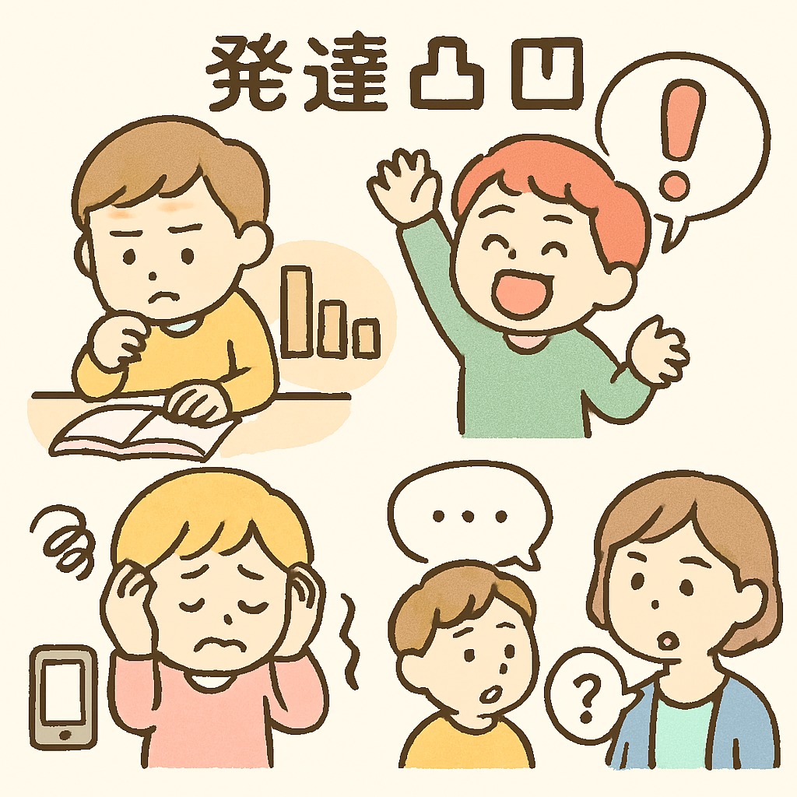
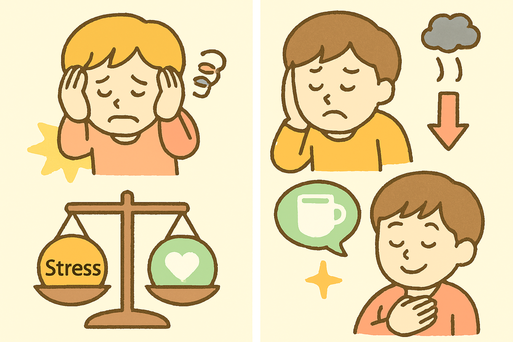

「発達凸凹さんのためのセルフケア・ガイドライン：自分らしく生きるためのヒント」

### はじめに

このガイドは、「発達凸凹（でこぼこ）」という特性を持つ方々が、日々の生活をより快適に、そして自分らしく送るためのヒントを提供することを目的としています。

*   「発達凸凹」とは、脳機能の特性に由来する個人の多様な特徴を指し、注意の集中度、行動の衝動性、感覚の受け止め方、人とのコミュニケーションの仕方など、さまざまな形で現れます。これは「病気」を治すというよりも、その人の「特性を理解し、適切に支えること」が重要であるという考え方が広まっています。また、これらの特性は知的遅れを伴わない場合も多く、社会生活の中で困難を感じることがありますが、それは決して本人が「わざとやっている」わけではありません。近年、「発達障害」と診断される人が増えている背景には、社会への知識の浸透や支援法の施行、そして「特性」「多様性」という概念の変化があると言われています。社会の側が求める変化に機敏に対応する現代社会や学校教育が、「発達凸凹」を持つ人が苦手とする特性を高度に発揮することを前提としているため、そこに適応できない特性を持つ人が「障害者」として認識される側面もあります。
    *   

*   発達凸凹の特性を持つ方々は、日常生活において定型発達の人に比べてより多くのストレスを感じやすい傾向があります。たとえば、感覚過敏によって音や光などの刺激に疲れやすかったり、予定の変更に対応が難しかったり、衝動的な感情表現に悩んだりするなど、さまざまな課題に直面することがあります。このような状況の中で、心身の健康を保つためには、意識的に自分自身をいたわる「セルフケア」の習慣を身につけることが非常に重要です。セルフケアは、自分の体調や心理状態をはっきりと認識し、それに基づいて適切な対策を講じることで、疲労回復、ストレス解消、心のバランスの維持に繋がります。
    *   

*   このガイドでは、発達凸凹の特性に合わせた実践的なセルフケアの方法をご紹介します。自分の得意なことと苦手なことを含め、自分自身の特性を深く理解することがセルフケアの第一歩です。その上で、日々の生活で直面する困難に対して具体的な工夫を取り入れ、自分らしい「生きやすい」方法を見つけていくことを目指します。完璧を目指すのではなく、「できたこと」に注目し、小さな成功体験を積み重ねることで自信と自己肯定感を育み、「ありのままの自分」を受け入れることを大切にします。一人で抱え込まず、必要に応じて家族や友人、そして専門機関などのサポートを求めることも、セルフケアの重要な一部です。このガイドが、あなたの「凸凹」を強みとして活かし、より豊かな人生を歩むための一助となれば幸いです。
    *   