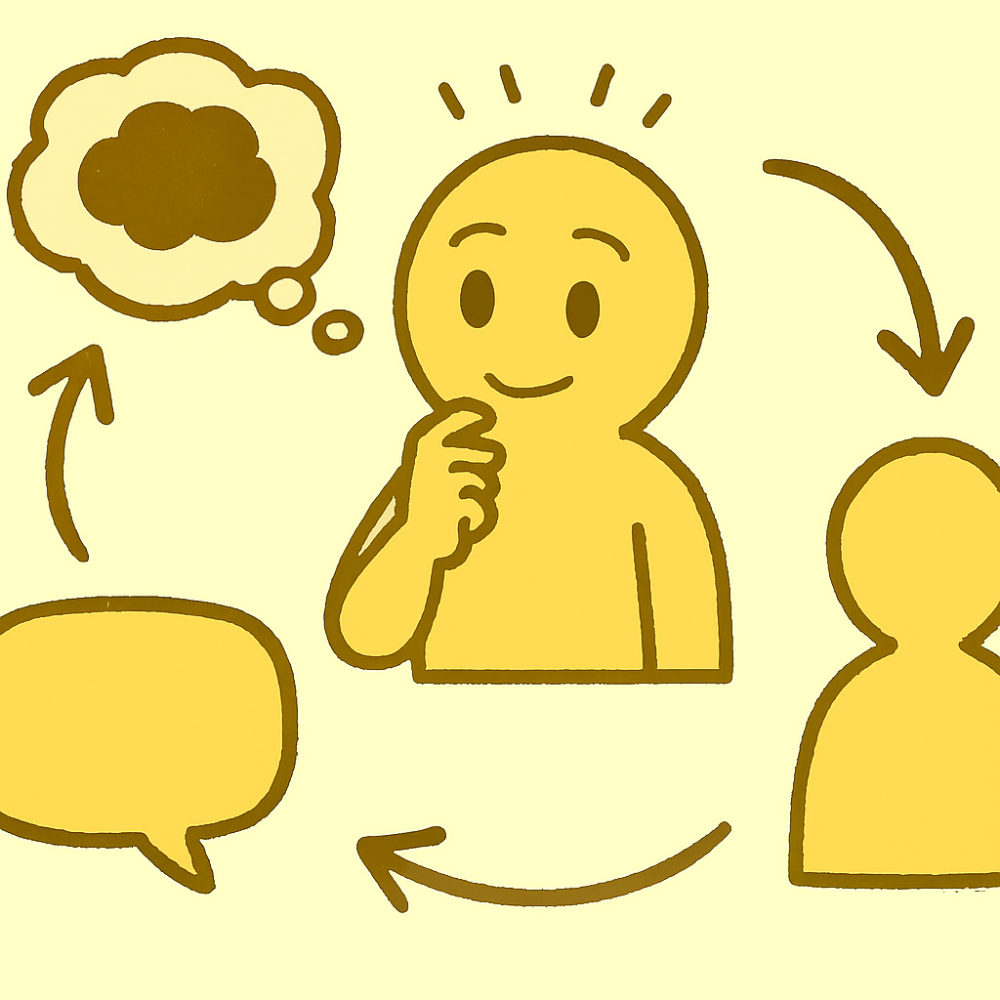
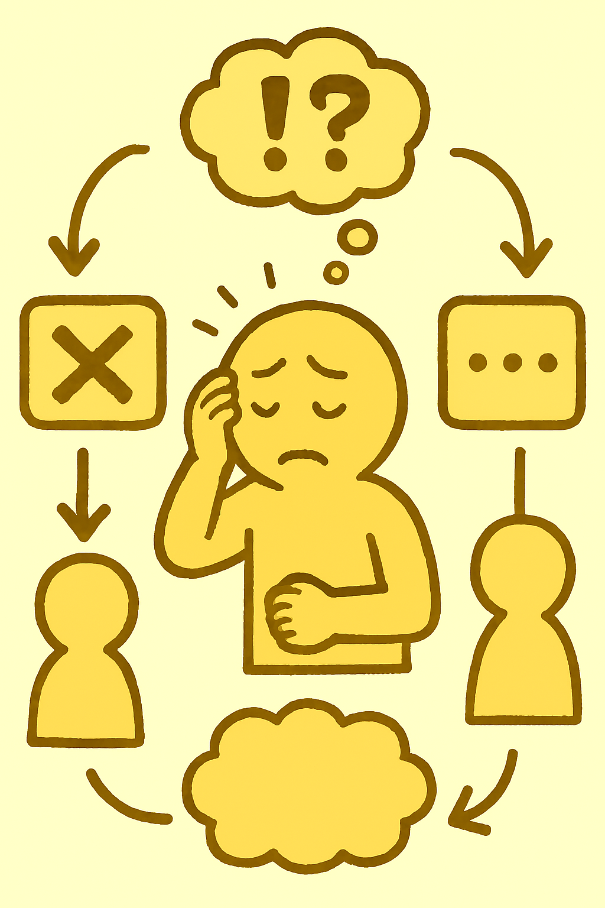
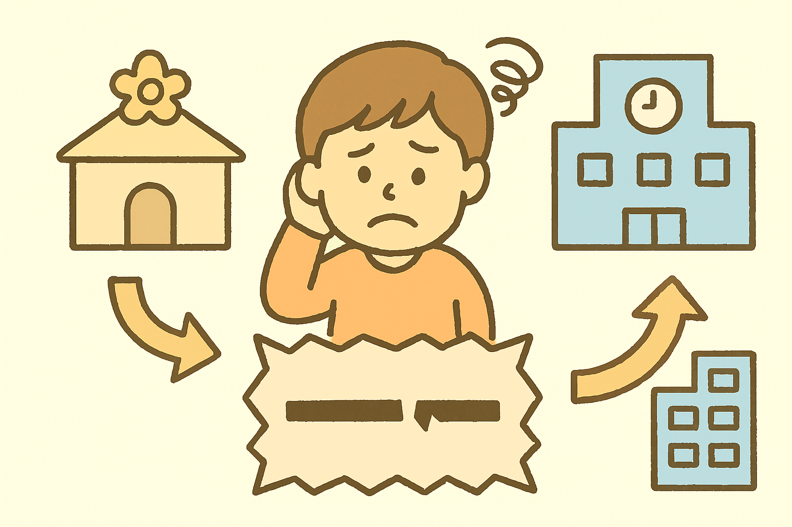
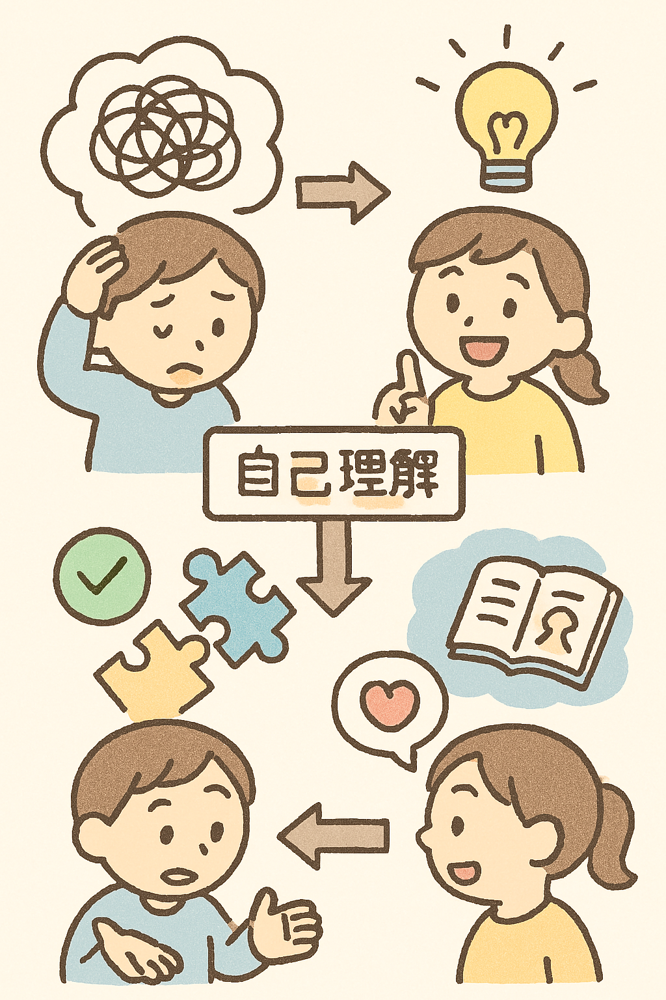
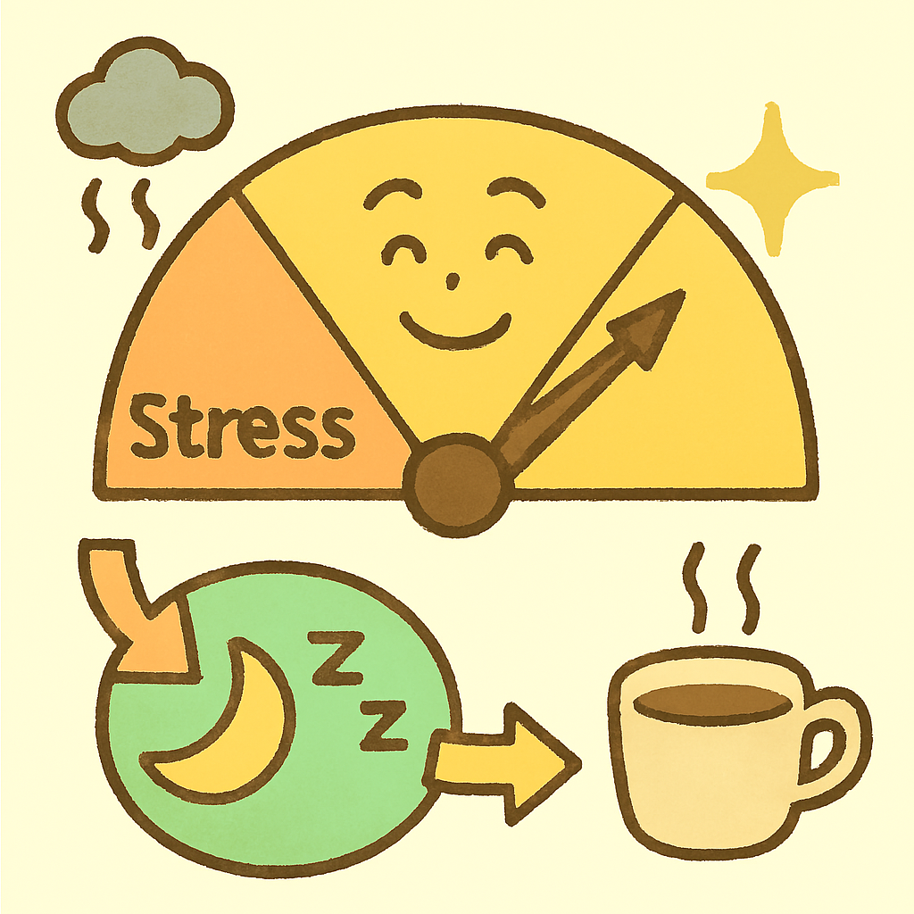
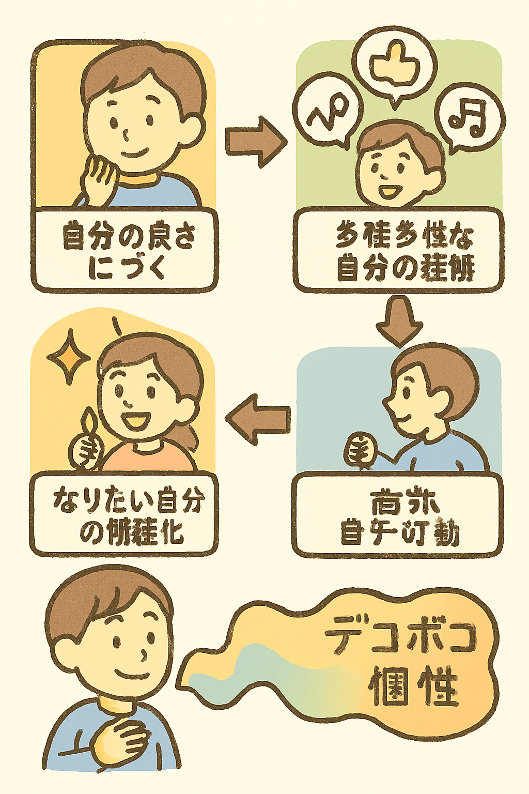
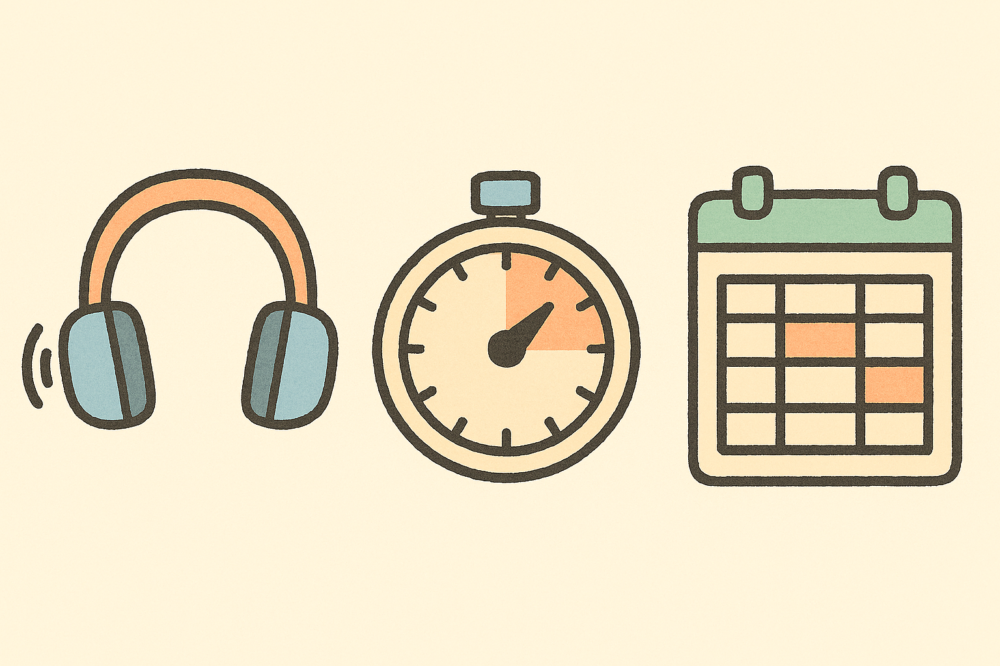

## 第1章　「凸凹」を活かす社会とセルフケアの重要性

### 1.1 発達特性と「凸凹」という考え方：誰もが持つ個性

この章では、「発達凸凹」とは具体的にどのような特性を指すのか、そして、それが単なる「障害」としてではなく、**「誰もが持つ個性」としての「凸凹」と捉える** 、新たな考え方について深掘りします。自分自身の特性を理解することは、セルフケアの第一歩です。

#### 1. 「発達凸凹」とは？その多様な特性

「発達凸凹」とは、**脳機能の特性に由来する個人の多様な特徴** を指す言葉です。これは「病気」を治すというよりも、その人の「特性を理解し、適切に支えること」が重要であるという考え方が広がっています。近年、「発達障害」と診断される人が増えている背景には、2005年の発達障害者支援法の施行、社会への知識の浸透、そして「発達障害」の概念が狭義の「病気」「障害」から「特性」「多様性」へと変化したことがあります。

発達凸凹の特性は、以下のように多岐にわたります。

*   **注意の集中度**：集中が持続しにくい、注意が散漫になりやすい、あるいは逆に1つのことに没頭しすぎる「過集中」が見られることがあります。
*   **行動の衝動性**：考えるよりも先に動いてしまったり、感情のコントロールが難しい場合があります。
*   **感覚の受け止め方**：音、光、匂い、温度などの刺激に敏感すぎたり（感覚過敏）、反対に鈍感すぎたりする場合があります。
*   **人とのコミュニケーションの仕方**：相手の気持ちや場の空気を読み取ることが苦手だったり、自分の話ばかりしてしまうなど、会話のキャッチボールに困難を感じることがあります。
*   **計画性や段取り**：物事を順序立てて進めるのが苦手だったり、優先順位をつけることに苦労することがあります。
*   **変化への対応**：予期しない変化に強い不安を感じ、適応が難しい場合があります。

これらは「**発達障害**」として診断される主な特性でもあり、具体的には以下のような種類があります。

*   **自閉スペクトラム症（ASD）**：社会的コミュニケーションの困難さや、特定の物事への強いこだわり、感覚特性などを特徴とします。
*   **注意欠如・多動症（ADHD）**：不注意、多動性、衝動性といった特性が見られ、過集中や忘れっぽさなども関連します。
*   **限局性学習症（SLD）**：全般的な知的発達に遅れがないにもかかわらず、「読む」「書く」「計算する」といった特定の学習能力に著しい困難を示します。

これらの特性は人それぞれ異なり、組み合わせも多様です。

#### 2. 「凸凹」という新たな視点：誰もが持つ個性

私たちは一人ひとりが異なる個性を持つように、脳機能の特性にも多様性があります。**「発達凸凹」という言葉は、このような特性をネガティブな「障害」としてだけでなく、その人の持つ「個性」や「多様性」として捉え直そう**という、より広い視点を含んでいます。

この考え方では、いわゆる「定型発達」とされる人々の中にも、**「デコボコ」な特性、すなわち得意なことと苦手なことがある** という視点が含まれます。Cさんの語りにも、「**ギリギリがんばって『普通の人』やってるけど、でも本来の自分じゃないっていう人がいっぱいいるはずなんですよ**」という言葉があるように、誰もが何らかの生きづらさを抱え得ると考えるのです。

「みんながデコボコ」であることを認め合えば、**問題は個人の努力不足ではなく、社会全体で分かち合い、共に解決していくべきもの**という認識に変わります。この新しい障害観は、「できる・できない」を問題とするのではなく、**人々が「ありのままに生きる」ことを重視**します。

#### 3. 自己理解：セルフケアの第一歩

発達凸凹の特性を持つ方々は、日常生活において定型発達の人に比べてより多くのストレスを感じやすい傾向があります。心身の健康を保つためには、意識的に自分自身をいたわる「セルフケア」の習慣が非常に重要です。

そして、このセルフケアの**もっとも大切な第一歩**が、**自分の特性を深く理解すること**です。

自己理解を深めるためには、以下のプロセスと方法が役立ちます。

*   **内省する**：
    *   自分の行動特性や感情のパターンを把握するために、日記や記録をつけるなどして、日常生活のルーティーンやトリガー（引き金）を観察してみましょう。
    *   自分がどんな時に「困る」のか、どんな時に「楽」なのか、どんな時に「集中できる」のか、どんな時に「疲れる」のかなど、具体的な状況を振り返ることで、自分の強みや長所、課題点や苦手な点に気づくことができます。
*   **他者からのフィードバックを得る**：
    *   信頼できる家族や友人、支援機関の専門家など、あなたのことをよく知っている人に、あなたがどんな「凸凹」を持っているように見えるか尋ねてみましょう。
    *   客観的な視点を取り入れることで、自分では気づかなかった特性や、当たり前だと思っていたことが実は強みだった、といった発見があります。
    *   「ジョハリの窓」のようなツールも、自己理解を深めるのに役立ちます。
*   **さまざまな体験をしてみる**：
    *   新しい環境や活動に挑戦することで、理論だけでなく実践を通して自分の特性を実感し、得意なことや苦手なことを明確にできます。
    *   この過程で、自分のニーズを他者に伝える「セルフ・アドボカシー・スキル（自己権利擁護力）」も育まれます。

自分の特性を理解し、**自分の「取扱説明書（トリセツ）」を作るイメージ**で、自分に合ったセルフケアの方法を見つけていきましょう。

### 1.2 生きづらさを感じる背景：発達障害を取り巻く現状と課題

この章では、発達凸凹を持つ人々が日常生活で「生きづらさ」を感じる具体的な背景について掘り下げます。社会の理解不足や制度的な課題、そして個人の特性がどのように影響し合うのかを理解することは、適切なセルフケアを見つける上で不可欠です。

#### 1.2.1 「苦労が『なかったこと』にされていた」：周囲の理解と社会的適応の困難

発達凸凹を持つ人々は、幼少期から、または成人になってから、**自身の苦労や困難が周囲に理解されず、「なかったこと」にされてきた**という経験を抱えていることがあります。これは、社会的な適応における大きな障壁となり、生きづらさの根源となり得ます。

*   **社会生活での具体的な困難の例**
    *   **職場での問題**：同じミスを繰り返したり、上司から「話をちゃんと聞いてない」「空気読めない」「常識がない」などと叱責されることがあります。仕事がうまくいかない理由が分からず、もどかしい状況が続くことがあります。
    *   **対人関係の困難**：
        *   相手の意図や会話の文脈、暗黙のルールを理解することが苦手なため、漠然とした違和感や不適応感が対人不安や被害的解釈につながりやすいとされます。
        *   「空気が読めない」「会話のキャッチボールができない」「一方通行な話し方をする」といった特徴が見られることがあります。
        *   非言語コミュニケーション（表情やジェスチャーなど）の読み取りが苦手な場合もあります。
    *   **行動や感覚の特性**：
        *   衝動的な行動や言動が多く見られたり、特定の物事への強いこだわりや執着を持つことがあります。
        *   音、光、匂い、温度などの刺激に敏感すぎたり（感覚過敏）、反対に鈍感すぎたりする**感覚の偏り**が見られることもあります。感覚過敏によって疲労が蓄積し、不眠につながることもあります。
        *   段取りや計画を立てることが苦手、時間の把握が苦手といった特性もあります。

*   **「普通」に適応しようとする努力と疲弊**
    *   発達凸凹を持つ人は、社会で目立たないように振る舞い、**「カモフラージュ」** を試みることがあります。
    *   Cさんの語りにあるように、「**ギリギリがんばって『普通の人』やってるけど、でも本来の自分じゃないっていう人がいっぱいいるはず**」という状況は、定型発達とされる人々の中にも存在し、誰もが何らかの生きづらさを抱え得ることを示唆しています。
    *   このような無理な適応努力は、自己肯定感やモチベーションの低下につながり、心身の疲弊を引き起こしやすい傾向があります。

#### 1.2.2 「発達障害」を取り巻く社会の変化と制度的課題

近年、「発達障害」の診断を受ける人が増加傾向にあります。これは、遺伝的な背景を持つ特性が昔から一定数存在していたことに加え、社会の変化や制度の整備が大きく影響しています。

*   **診断数増加の背景と概念の変化**
    *   **2005年の発達障害者支援法の施行**以降、発達障害の早期発見や医療・療育機関との早期連携が進みました。
    *   **発達障害に関する知識の社会への浸透**により、自身や周囲の人が発達障害ではないかと医療機関を受診する人が増えました。
    *   「発達障害」の概念が、狭義の「病気」「障害」から「**特性**」「**多様性**」へと変化し、いわゆる「**定型発達**」と連続する**スペクトラム構造**をなすことが明らかにされたことも、診断数増加の一因です。

*   **現代社会がもたらす生きづらさ**
    *   21世紀に入り、社会は日々、**新しい要求に晒され、迅速かつ柔軟な対応が求められる**ようになりました。たとえば、初対面の人とすぐに効果的なコミュニケーションをとることが期待されるなど、これらの特性が苦手な人にとっては適応が難しい環境になりつつあります。
    *   現代の社会や学校教育は、発達障害を持つ人が苦手とする特性（例：高度なコミュニケーション能力、計画性、変化への機敏な対応）を高度に発揮することを前提に成り立っているため、そこに**適応できない特性を持つ人が「障害者」として浮き彫りになる**という見方もあります。

*   **成人期に診断を受けることの意義と課題**
    *   近年、周囲との不協和や生きづらさを抱えながら生活してきた成人が、発達障害の診断を求めて精神科を訪れるケースが目立ちます。
    *   診断を受ける理由として、「人生の今までの経緯のわけを知りたい」「自分のつじつまを納得して生きていきたい」「自分を説明する言葉が欲しい」といった声が聞かれます。診断により、うまくいかない原因が自分の努力不足なのか、障害のせいなのかといった、**困難の根拠を明らかにしたい**というニーズがあります。
    *   診断を受け入れることで、**もやもやしていた状況が解消され、納得や安心感**を得られることがあります。これは、発達障害が特殊な病気ではなく、脳機能に関連する多様な特性の1つであると実感できるためです。

*   **制度的な課題と情報の断絶**
    *   日本の支援制度では、未就学期は福祉、就学すると教育、就労すると再び福祉へと管轄が移り変わり、**当事者の特性や支援履歴の情報が途切れてしまう**「情報の断絶」という大きな課題が存在します。
    *   現状では保護者に頼る部分が大きいため、**「一生を通じたパーソナルデータ」のような仕組み**や、途切れることなく支援をつなぐ専門員の必要性が指摘されています。
    *   個々の支援者のノウハウが共有されにくい「属人化」も課題であり、現場の実践から得られたデータを活用し、**「プラクティス・ベースド・エビデンス（実践に基づいた証拠）」** を構築していくことが重要だと考えられています。

#### 1.2.3 ストレスとセルフケアの必要性：生きづらさを軽減するために

発達凸凹を持つ人々は、その特性上、日常生活において定型発達の人に比べてより多くのストレスを感じやすい傾向にあります。

*   **発達凸凹とストレスの関連**
    *   外部からの刺激（ストレッサー）を広く、強く感じやすく、さらに感覚過敏や疲れやすさ（易疲労性）といったストレスに対する弱さが重なることで、**心の容量がいっぱいになりやすい**傾向があります。
    *   自身の心理状態を認識しにくかったり、快・不快の認知が困難なために、ストレスの原因を回避できず、身体症状としてはじめてストレスに気づくこともあります。
    *   ADHDの特性を持つ人は、不注意・多動性・衝動性により疲労につながる行動が増え、睡眠時間が長くなる傾向があります。また、過集中によって食事や睡眠がおろそかになり、生活リズムが乱れることもあります。
    *   ASDの特性を持つ人も、感覚過敏や過集中が睡眠の悩みにつながると考えられます。

*   **セルフケアの重要性**
    *   このようなストレスを抱えやすいため、心身の健康を保つためには、意識的に自分自身をいたわる**「セルフケア」の習慣**が非常に重要です。
    *   セルフケアには、生活習慣（睡眠、食事、健康管理）、自分の身体を守ること、自分だけの場所・時間（パーソナルスペース）を持つこと、ストレス発散・リフレッシュ法を見つけることなどが含まれます。

*   **ストレスコーピングと多様な対処法**
    *   ストレスを完全に排除することは不可能であるため、**ストレスとどう向き合っていくか**を考える「ストレスコーピング（対処）」が大切です。
    *   ストレスコーピングには、主に以下の4つの方法があります：
        *   **心の健康の基礎をつくる（レジリエンスを鍛える）**：ストレスに対する抵抗力を高めます。
        *   **外部にサポートを求める**：他者や専門家（発達支援センター、医療機関など）に相談し、助言や支援を求めます。
        *   **問題焦点型コーピング**：問題に直接働きかけ、解決を図ります。
        *   **情動焦点型コーピング**：積極的に気分転換を図るなどして、感情や行動をコントロールします。

*   **自己理解：セルフケアの第一歩**
    *   セルフケアの**もっとも大切な第一歩**は、**自分の特性を深く理解すること**です。
    *   自分の行動特性や感情のパターンを把握し、自分の得意なことと苦手なことを明確にすることは、自分に合ったセルフケア方法を見つけるために不可欠です。
    *   **自分の特性を理解し、周囲の人々に自分が必要としているサポートを理解してもらう能力**、すなわち「**セルフ・アドボカシー・スキル（自己権利擁護力）**」を育成することも重要です。
    *   自分の「**取扱説明書（トリセツ）**」を作るイメージで、自分に最適なセルフケアの方法を見つけていきましょう。

### 1.3 セルフケアとは何か：自分を助ける力「セルフヘルプ」の第一歩

セルフケアとは、発達障害の特性を持つ人々が、日常生活で感じやすいストレスを軽減し、心身の健康を維持するために、**意識的に自分をいたわる習慣**を築くことです。これは、無理に周囲に合わせることで生じるストレスを減らし、自分に合った最適な方法を見つけることにつながります。

セルフケアの具体的な要素は多岐にわたりますが、主に以下の点が挙げられます。

*   **生活習慣の確立**：質の良い睡眠、栄養バランスの取れた食事、適度な運動など、基本的な健康管理を行うことです。
*   **パーソナルスペースの確保**：自分だけの落ち着ける場所や時間を持つことで、心身の回復を促します。
*   **ストレス対処法の多様化**：自分に合ったストレス発散方法やリフレッシュ法を複数見つけ、実践することです。

#### 自分を助ける力「セルフヘルプ」

セルフケアには、自分自身の問題を自律的に管理し、解決していく「**セルフヘルプ（自助）**」の概念が深く関わっています。これは、自分がどんな困難を抱えているかを理解し、必要なサポートを他者に適切に伝える能力、すなわち「**セルフ・アドボカシー・スキル（自己権利擁護力）**」を育むことにもつながります。

セルフヘルプの代表的な活動に「**自助グループ（セルフヘルプグループ）**」があります。

*   **共通の「居場所」の提供**：自助グループは、同じ発達障害の特性や悩みを抱える当事者同士が、対等な関係で情報や感情、考えを共有できる場所です。
*   **安心感と自己肯定感の回復**：ここでは、「自分だけではない」と感じることで、孤立感が軽減され、安心感や生きる希望、勇気を得て、自尊感情を取り戻すことができます。
*   **社会参加への足がかり**：自助グループは、社会とのつながりが難しいと感じる発達障害の当事者にとって、ありのままの自分を受け入れてもらえる貴重な「サード・プレイス」となり、社会参加への第一歩となる可能性があります。

#### 自己理解と特性の受容がセルフケアの土台

セルフケアを効果的に行うためには、まず**自己理解**を深めることが不可欠です。

*   **特性の把握**：自分の得意なこと、苦手なこと、考え方の癖、感覚の特性（感覚過敏や鈍感さなど）を正確に知ることで、自分に合った対処法を見つけやすくなります。
*   **「原因」の理解**：過去の失敗や困難が、個人の努力不足や怠慢によるものではなく、発達障害の特性に起因するものであると理解することで、心の負担や自己否定感を軽減できます。
*   **診断の受容**：診断を受けることで、それまで漠然と抱えていた生きづらさの理由が明確になり、納得と安心感が得られる場合があります。これは、困難を克服することよりも「自分らしく生きること」を大切にするマインドセットへの変化を促します。
*   **「デコボコ」の肯定**：発達障害の特性は「治すもの」ではなく「その子の特性を理解し、適切に支えること」が大切です。誰もが「デコボコ（得意不得意）」を持っているという新たな障害観を持つことで、ありのままの自分を肯定し、強みとして捉えることができるようになります。

#### 環境調整によるサポート

発達障害を持つ人々、とくに子どもたちは、環境の変化に敏感に反応することがあります。そのため、無理に本人を変えようとするのではなく、**周囲の環境を整える**ことが、快適な生活を送るための効果的な支援となります。

*   **刺激の軽減**：感覚過敏がある場合は、静かな部屋を用意する、イヤーマフを使用する、光の刺激を減らすなどの工夫が有効です。
*   **タスクの調整**：集中力が持続しにくい場合は、タスクを短時間で区切る学習スタイルや作業方法を取り入れます。
*   **見通しの明確化**：予期せぬ変化による混乱を避けるため、スケジュール表を活用して、今後の見通しを持たせることも重要です。
*   **「苦手」の回避**：主催者が自身の「苦手」な業務を避けることで、無理なく活動を継続できるように、支援の仕組みや協力を得ることも環境調整の一環です。

これらのセルフケアの実践は、発達障害を持つ人々が自分らしく、そしてより豊かな生活を送るための基盤となります。小さな一歩から始めることが、大きな変化につながるでしょう。

### 1.4 本ガイドラインの目的と期待される効果

このガイドラインは、「発達凸凹さん」が日々の生活で感じる困難やストレスを軽減し、**自分らしい人生を主体的に築いていく**ための具体的なヒントを提供することを目的としています。私たちは、発達特性を単なる「苦手」と捉えるだけでなく、**「デコボコ」という個性や強み**として活かす視点も大切にしながら、セルフケアの実践をサポートします。

本ガイドラインの主な目的は以下の通りです。

*   **自己理解の深化**：ご自身の発達特性や得意・不得意を深く理解し、それらを受け入れること。これにより、これまで漠然と感じていた「生きづらさ」の理由が明確になり、納得感と自己肯定感の向上につながります。
*   **実践的なセルフケア・ストレス対処法の習得**：日常生活におけるストレスのサインに気づき、心身の健康を保つための具体的な方法（例：質の良い睡眠、栄養バランスの取れた食事、適度な運動、リラクゼーション技法）を学び、実践できるようにすること。
*   **社会生活スキルの向上**：ケアレスミスの軽減、効果的なタスク管理、時間管理、片付けの苦手克服など、日々の困りごとに対する実践的な対処法を身につけること。
*   **コミュニケーション能力と人間関係の円滑化**：他者との効果的なコミュニケーションや人間関係の築き方を学び、孤立感を解消し、安心できる居場所を見つけること。
*   **自己権利擁護（セルフ・アドボカシー）スキルの育成**：自身のニーズを理解し、周囲に必要なサポートを適切に伝え、社会的なつながりを広げる力を養うこと。

**本ガイドラインから期待できる効果**

このガイドラインを通じて、読者の皆様は以下のような変化を期待できます。

*   **日々の生活の質の向上**
    *   ストレスが軽減され、心身ともに穏やかに過ごせる時間が増えます。
    *   タスク管理や時間管理がスムーズになり、日常生活での「できない」が減ります。
    *   質の良い睡眠を確保し、疲労回復が促されます。

*   **感情の安定と自己肯定感の向上**
    *   感情の波を理解し、衝動的な反応を穏やかにコントロールできるようになります。
    *   自分の「デコボコ」な部分も含めてありのままの自分を受け入れ、自信を持って行動できるようになります。
    *   「もう無理！」「どうせうまくいかない」といった否定的な思考パターンに気づき、より柔軟な考え方を身につけます。

*   **社会とのつながりの強化**
    *   他者とのコミュニケーションが円滑になり、対人関係のストレスが減少します。
    *   同じ経験を持つ仲間との出会いを通じて、孤立感が軽減され、安心できる「居場所」を見つけられます。
    *   必要なときに適切な専門家や支援機関に相談し、サポートを得られるようになります。

本ガイドラインは、一律の「こうあるべき」を押し付けるものではなく、**一人ひとりの「自分らしさ」を尊重し、それぞれのペースで「できること」を増やしていく**ことを重視しています。困難を克服すること以上に、**特性と上手に付き合いながら、自分らしい豊かな人生を歩む**ための羅針盤となることを目指します。

